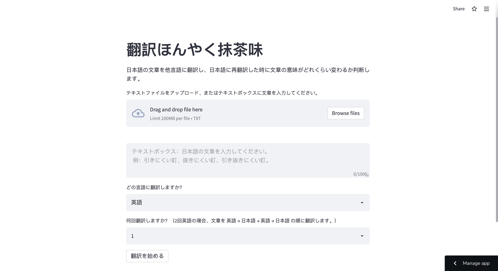
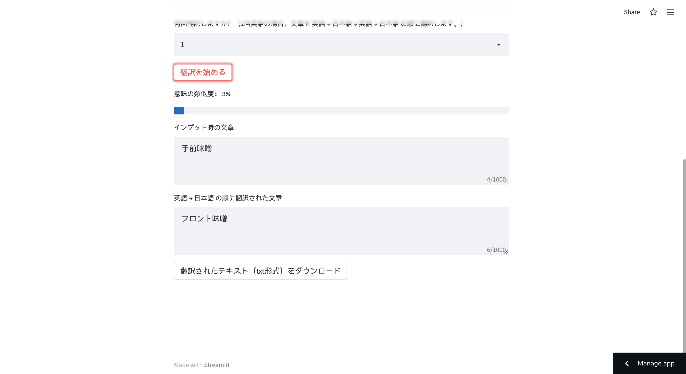

# 翻訳ほんやく抹茶味 (Python: Streamlit)

アプリのリンク: https://share.streamlit.io/rtorii/honyaku-honyaku/main/main.py

**説明：**

このアプリは、日本語の文章を他言語（ユーザーが選択）に翻訳し、日本語に再翻訳した時に文章の意味がどれくらい変わるか判断します。

プログラムがすること：
1. 入力された文章をGoogle翻訳でユーザーが選択した言語に翻訳します。
2. 翻訳された文章を日本語に翻訳します。
3. もし複数回の翻訳をユーザーが選択した場合、翻訳を繰り返します。
4. 入力時の文章と翻訳後の文章の意味の類似度を計算し、表示します。

**アプリの使い方:**

1. 日本語の文章をテキストボックスに入力、またはテキストファイル（txt形式）をアップロードします。
2. 変換する言語と何回変換するかを選択します。例えば、2回英語と選択した場合、文章を　英語 → 日本語 → 英語 → 日本語　に変換します。
3. `翻訳を始める`ボタンを押します。これでプログラムが文章の翻訳を開始します。
4. 翻訳が終了すると、インプット時の文章と翻訳された文章との類似度が表示されます。

基本的に、どの言語を選択してもGoogle翻訳の精度は高いです。ただしことわざや四字熟語（手前味噌など）は、翻訳した際、全く意味の違うことになる場合が少なくないです。

翻訳の例：`東京特許許可局長今日急遽休暇許可拒否`を文章とし、オランダ語を選択した場合の翻訳結果を下記に表示しています。
| 翻訳回数 | 翻訳後の文章 | 類似度 | 
| ------ | ------ | ------ | 
| 1回（オランダ語 → 日本語）| 東京特許付与局長が本日突然休暇を拒否した | 75％ |
| 2回 （オランダ語 → 日本語 → オランダ語 → 日本語）| 東京特許付与部長が本日突然休暇を取ることを拒否した | 69% |
| 3回 （オランダ語 → 日本語 → オランダ語 → 日本語 → オランダ語 → 日本語）| 東京特許助成局長が本日突然休暇を取ることを拒否した | 71% |
| 4回 （オランダ語 → 日本語 → オランダ語 → 日本語 → オランダ語 → 日本語 → オランダ語 → 日本語）| 東京特許付与局長が本日突然さよならを言うことを拒否した | 66% |
| 5回 （オランダ語 → 日本語 → オランダ語 → 日本語 → オランダ語 → 日本語 → オランダ語 → 日本語 → オランダ語 → 日本語）| 東京特許付与局長が本日さよならを言うことを突然拒否した | 66% |

**注意点：**
- ウェブサイトを開く時、Word2vecモデルをAmazon S3から読み込むため、プログラムの準備に時間がかかります。
- 文章が名詞、動詞、形容詞以外のワード、またはWord2vecモデルに存在しないワードだけで構成される場合、ベクトル化できないため、プログラムエラーが発生します。
  - 例えば、`五里霧中`を韓国語に翻訳し、日本語に翻訳した時、文章は`リングフォグ`となります。`リングフォグ`をMeCabで分かち書きした場合、`リングフォグ`のままですが、`リングフォグ`がWord2vecモデルに存在しないため、`リングフォグ`をベクトル化できません。そのためプログラムエラーが発生します。

| ホームページ |  
| ------ | 
|  |  

| 文章を入力する |  
| ------ | 
|  |  

| 翻訳後 |  
| ------ | 
|  | 

**文章の類似度の計算方法：**

1. 文章をWord2vecでベクトル化します。
   - 文章をMeCabでワードに分割し、名詞、動詞、形容詞のワードをWord2vecでベクトル化し、それらの平均ベクトルを文章のベクトルとしました。
2. コサイン類似度を計算します。コサイン類似度が0以上の場合、コサイン類似度 ✕ 100% を文章同士の類似度としました。例えばコサイン類似度が0.99の場合、類似度は99％とします。コサイン類似度が0未満の場合は、類似度を1％未満としました。

**文章をベクトル化するWord2vecモデルの作成：**

日本語のWikipediaの記事をMeCabで分かち書きしたデータで学習しました。ベクトルの次元は、200次元です。
- Word2vecモデル作成の際に参照した記事：https://qiita.com/Ninagawa_Izumi/items/4e9b895e233c982118fb

モデルは、GitHubにアップするには、容量が大きいため、Amazon S3に保存しています。
- モデルのダウンロード: https://streamlithonyakudata.s3.ap-northeast-1.amazonaws.com/model.bin

05/09/22に作成。
