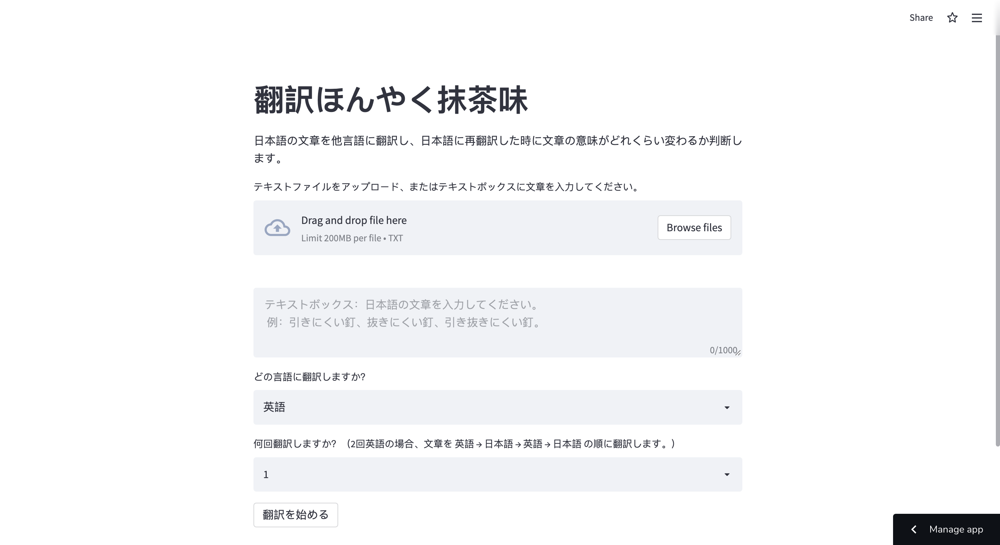
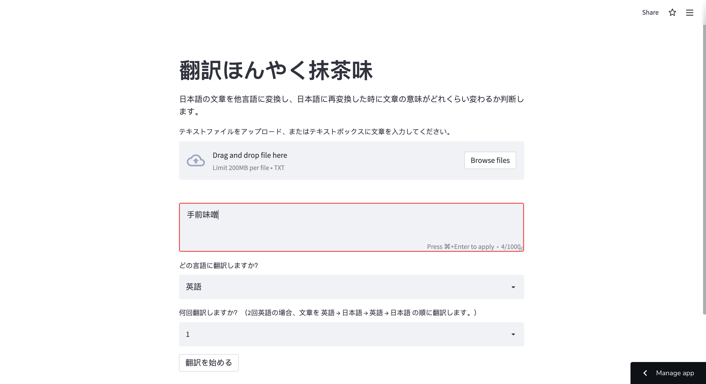
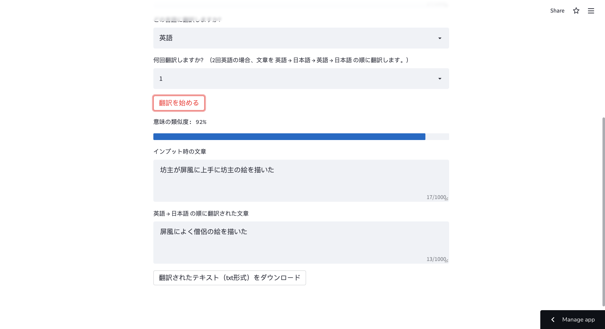

# Honyaku Honyaku Matcha Flavor (Python: Streamlit)

Link to the app: https://share.streamlit.io/rtorii/honyaku-honyaku/main/main.py

**Description:**

This web app uses Google Translate to translate Japanese text to the language set by the user. Then it translates the text back to Japanese and checks how much the meaning of the text changed.

What the program does:
1. Translates the input text to the language set by the user.
2. Translate the text back to Japanese.
3. If the user selected multiple translations, the translation is repeated.
4. Calculates and displays the similarity of meaning between the input and the translated text.

**How to use the app:**

1. Either type Japanese text in the text box or  upload a text file in txt format.
2. Select the language and the number of translations. For example, if you select English and two translations, the text will be translated from English → Japanese → English → Japanese. 
4. Press the `翻訳を始める` button. This prompts the program to start translating the text.
5. when the translation is finished, similarity of meaning between the input and the translated text is displayed.

Example: Translating `東京特許許可局長今日急遽休暇許可拒否` to Dutch.
| # of translations | text after translation | similarity | 
| ------ | ------ | ------ | 
| 1（Dutch → Japanese）| 東京特許付与局長が本日突然休暇を拒否した | 75％ |
| 2 （Dutch → Japanese → Dutch → Japanese）| 東京特許付与部長が本日突然休暇を取ることを拒否した | 69% |
| 3 （Dutch → Japanese → Dutch → Japanese → Dutch → Japanese）| 東京特許助成局長が本日突然休暇を取ることを拒否した | 71% |
| 4 （Dutch → Japanese → Dutch → Japanese → Dutch → Japanese → Dutch → Japanese）| 東京特許付与局長が本日突然さよならを言うことを拒否した | 66% |
| 5 （Dutch → Japanese → Dutch → Japanese → Dutch → Japanese → Dutch → Japanese → Dutch → Japanese）| 東京特許付与局長が本日さよならを言うことを突然拒否した | 66% |

**Note:**
When you open the web app, it may take some time for the program to load since it loads the Word2vec model stored on Amazon S3.

| Homa page |  
| ------ | 
|  |  

| Input text |  
| ------ | 
|  |  

| After translating the text |  
| ------ | 
|  | 

**How to calculate the similarity of meaning：**

1. Vectorize the text using the Word2vec model trained using data from Japanese Wikipedia articles. The dimensions of the vector are 200.
  - Since the model is too big to upload on GitHub, it is saved on Amazon S3.
  - Link to download the model: https://streamlithonyakudata.s3.ap-northeast-1.amazonaws.com/model.bin
2. Calculate cosine similarity between two texts. If cosine similarity is 0 or greater, the similarity of meaning is set as cosine similarity ✕ 100%. For example, the similarity of meaning is 99% if cosine similarity is 0.99. If cosine similarity is less than 0, the similarity of meaning is set as "less than 1%."

Created By Ryota Torii <rtorii@protonmail.com> on 05/09/22.
